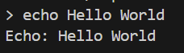
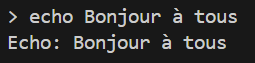
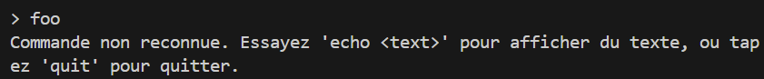
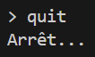

# REPL (Read-Eval-Print Loop) - Exercice d'introduction

## Objectif

L'objectif de cet exercice est de comprendre le fonctionnement d'un interpréteur de commandes simple et de tester ses fonctionnalités.

## Instructions

### Étape 1 : Compilation du programme
Utilisez un compilateur C, tel que `gcc`, pour compiler le programme `repl.c`. Exécutez la commande suivante dans votre terminal :

```bash/
gcc -o repl repl.c
```

Cela compilera le programme en un exécutable nommé `repl`.

### Étape 2 : Exécution du programme

Une fois le programme compilé, exécutez-le en tapant la commande suivante :

```bash/
./repl
```

Cela lancera le programme et vous verrez le prompt `>`. À partir de là, vous pouvez entrer des commandes et observer les résultats.

### Étape 3 : Tester les commandes

Voici quelques commandes que vous pouvez tester pour observer les réponses du programme :

1. **Commande** : `echo Hello World`
    - **Résultat attendu** : Le programme affichera `Echo: Hello World`.
    - **Capture d'écran** :
    
      

2. **Commande** : `echo Bonjour à tous`
    - **Résultat attendu** : Le programme affichera chaque mot de la commande sur une nouvelle ligne :
      ```bash/
      Echo: Bonjour
      Echo: à
      Echo: tous
      ```
    - **Capture d'écran** :
    
      

3. **Commande** : `foo`
    - **Résultat attendu** : Le programme affichera `Commande non reconnue...`.
    - **Capture d'écran** :
    
      

4. **Commande** : `quit`
    - **Résultat attendu** : Le programme se terminera.
    - **Capture d'écran** :
    
      

### Conclusion

Cet exercice permet de découvrir le fonctionnement basique d'un interpréteur de commandes (REPL) et d'observer comment il gère différentes commandes entrées par l'utilisateur.
